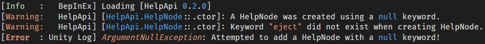
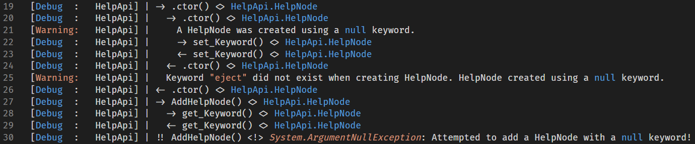

# LoggingApi
### Please report any issues [here]()

## Overview
Offers simple methods for adding debug logs to method calls. Also provides a variety of log formatting options to users.

## Game Installation
Drag the `LoggingApi.dll` to your `BepInEx/plugins` folder, or just install the mod via a Thunderstore mod loader.

## Table of Contents
1. [Features](#features)
2. [Development Usage](#development-usage)
3. [Logger Class](#logger-class)
   - [Normal Logs](#normal-logs)
   - [Logging Calls](#logging-calls)
4. [SearchFlags Enum](#searchflags-enum)

## Features
### Source of log messages

### Call trace when viewing debug logs

> *Images were taken in VSCode/Codium with the [FiraCode](https://github.com/tonsky/FiraCode) font*

## Development Usage
Add the following to your project's `.csproj` file, replacing `[FILEPATH]` with the path to the `LoggingApi.dll`
```xml
<ItemGroup>
  <Reference Include="LoggingApi">
    <HintPath>[FILEPATH]\LoggingApi.dll</HintPath>
    <Private>false</Private>
  </Reference>
</ItemGroup>
```

## Logger Class
New loggers are created using a `ManualLogSource` and `LogLevel`.
 - The log source is typically your plugins `base.Logger`
 - It is recommended to use pass a log level set by a config for your plugin.
   - This allows user to change the level of logs shown.
   - View the [BepInEx documentation](https://docs.bepinex.dev/articles/dev_guide/plugin_tutorial/4_configuration.html) on how to create configs.

### Normal Logs
Here is an example of how to set up a global logger for your plugin. 
```C#
public class Plugin : BaseUnityPlugin
{
    internal static LoggingApi.Logger MyLogger; // Global logger for the plugin
    internal static ConfigEntry<LogLevel> ConfigLogLevel; // Config to control which logs are shown
    ...

    private void Awake()
    {
        MyLogger = LoggingApi.Logger(base.Logger, ConfigLogLevel) // Create a new logger

        MyLogger.Log(LogLevel.Message, "Hello World!")
        MyLogger.LogMessage("Hello World!")
    }
}

// Some other class in the plugin assembly
class SomeOtherAssembly
{
    public void SomeMethod()
    {
        Plugin.MyLogger.LogMessage("Hello World!")
    }
}
```

### Logging Calls
With the logger class you can log all calls to members of a type or just specific members of the type.
```C#
public class Plugin : BaseUnityPlugin
{
    internal static LoggingApi.Logger MyLogger; // Global logger for the plugin
    internal static ConfigEntry<LogLevel> ConfigLogLevel; // Config to control which logs are shown
    ...

    private void Awake()
    {
        MyLogger = LoggingApi.Logger(base.Logger, ConfigLogLevel) // Create a new logger

        MyLogger.LogAllCalls(typeof(SomeOtherAssembly)) // All type members
        MyLogger.LogCalls(typeof(SomeOtherAssembly), LoggingApi.SearchFlags.Public) // Only public type members
    }
}

// Some other class in the plugin assembly
class SomeOtherAssembly
{
    public void SomeMethod()
    {
        ...
    }
}
```

## SearchFlags Enum
Flags to filter which type members are included in a search.
